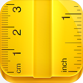
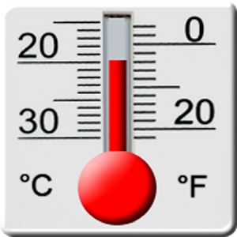
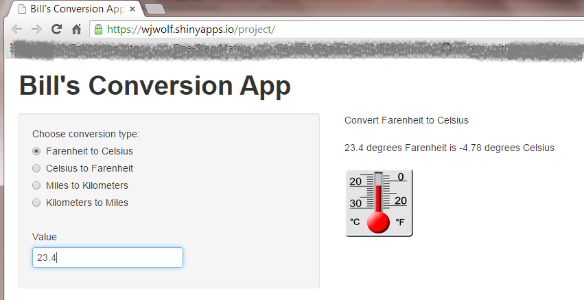

## Converting between units of measure ...

<div align="right">
    <h2>can be confusing!!</h2>
    <br/>
</div>
<div align="left">
    
    </br>
    <h3>&bull;&nbsp;How many milimeters are in an inch?</h3>
    <br/>
</div>
<div align="center">
    <h3>&bull;&nbsp;How many kilometers are there in 23.2 miles?</h3>
    <br/>
</div>
<div align="right">
    <h3>&bull;&nbsp;What is 200.3 degrees Fareheit in Celcius?</h3>
    <br/>
    
</div>


--- .class #id 

## There are many many formulas to remember

<h3>For example converting tempature is<h3>
<div align="center">
    <table border="1" align="center">
        <tr border="1" align="center">
    	    <td><strong>&deg;F&nbsp;to&nbsp;&deg;C</strong></td>
    		<td>Subtract 32, multiply by 5, then divide by 9</td>
    	</tr>
    	<tr border="1" align="center">
    	    <td><strong>&deg;C&nbsp;to&nbsp;&deg;F</strong></td>
    	    <td>Multiply by 9, divide by 5, then add 32</td>
    	</tr>
    </table>
</div>
<br/>
<h3>and converting between miles and kilometers is<h3>
<div align="center">
    <table border="1" align="center">
        <tr border="1" align="center">
            <td><strong>mile to kilometer</strong></td>
    		<td>Divide miles by 0.62137</td>
    	</tr>
    	<tr border="1" align="center">
    	    <td><strong>kilometer to mile</strong></td>
    	    <td>Multiply kilometers by 0.62137</td>
    	</tr>
    </table>
</div>

--- .class #id 

## But help is at hand!!

<h3>Use Bill's Conversion App -- New! Improved! Shiny!</h3>



--- .class #id 

## Powered by R

<h3>&bull;&nbsp;How many kilometers are there in 23.2 miles?</h3>


```r
  miles<-23.2
  kilometers<-miles/0.62137
  print(round(kilometers,digits=2))
```

```
## [1] 37.34
```


<h3>&bull;&nbsp;What is 200.3 degrees Fareheit in Celcius?</h3>


```r
  farenheit<-200.3
  celcius<- (farenheit - 32) * 5 / 9
  print(round(celcius,digits=2))
```

```
## [1] 93.5
```


